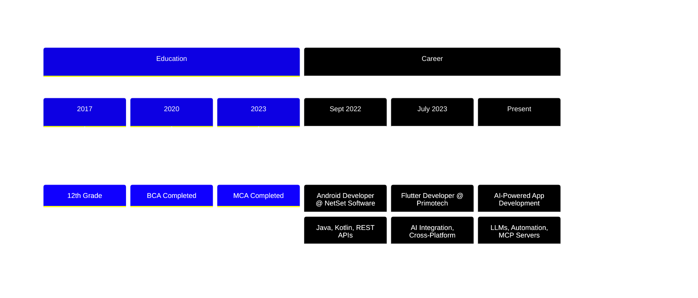

<div align="center">

<!-- Animated Header -->


<!-- Typing SVG -->
<p align="center">
  <a href="https://git.io/typing-svg"></a>
</p>

<!-- Profile Views Counter -->
<p align="center">
  
  
</p>

</div>

---

<!-- About Me Section with Gradient -->


### 👨‍💻 About Me

```dart
class AakashMishra {
  final String location = "📍 Chandigarh, India";
  final double experience = 2.9;
  final String currentRole = "Flutter Developer @ Primotech";
  
  final List<String> expertise = [
    "Cross-Platform Development 📱",
    "AI-Powered Applications 🤖",
    "Backend Integration ☁️",
    "LLM Implementation 🧠"
  ];
  
  void currentlyWorking() {
    print("🔥 Building intelligent apps with Flutter & AI");
    print("🚀 Exploring cutting-edge AI tools");
    print("⚡ Optimizing performance & UX");
  }
  
  String funFact() => "I turn coffee into code! ☕️→💻";
}
```

<br clear="right"/>

---

## 🛠️ Tech Arsenal

<div align="center">

### 📱 Mobile Development


### 🤖 AI & Automation


### 🔧 Backend & Tools


### 🎨 Design & Video


</div>

---


## 📊 GitHub Analytics

<div align="center">
  
  
</div>

<div align="center">
  
  
</div>

<!-- GitHub Trophies -->
<div align="center">
  
</div>

---

## 💼 Professional Journey

<div align="center">



</div>

---

## 🎯 Current Focus

<div align="center">

| 🔥 Working On | 🌱 Learning | 🎮 Exploring |
|:---:|:---:|:---:|
| AI-Powered Apps | Advanced LLM Integration | Rapid App Prototyping |
| Flutter Performance | MCP Server Architecture | AI Automation Tools |
| Backend Optimization | Prompt Engineering | Video Editing with Adobe |

</div>

---

## 📈 Contribution Activity

<div align="center">
  
</div>

---

## 🎮 When I'm Not Coding...

<div align="center">

```javascript
const aakash = {
  hobbies: ["📷 Photography", "🎬 Video Editing", "🎵 Music", "🎮 Gaming"],
  favoriteDrink: "☕ Coffee (lots of it)",
  superPower: "Debugging at 3 AM",
  motto: "Code. Build. Ship. Repeat. 🔄"
};
```

</div>

---

## 🌐 Let's Connect

<div align="center">

[](https://www.linkedin.com/in/aakash-mishra-a20892396)
[](mailto:maakash053@gmail.com)
[](https://wa.me/918427374677)
[](https://github.com/Aakash898)

</div>

---

## 💡 Random Dev Quote

<div align="center">


</div>

---

<div align="center">

### 💭 "Code is like humor. When you have to explain it, it's bad." – Cory House

</div>

---

<div align="center">

### Show some ❤️ by starring some of my repositories!


</div>

---

<div align="center">

**⚡ Fun Fact:** I can debug code faster with coffee ☕️

*Last Updated: February 2025*

</div>
